# Diagramas de Casos de Uso - Sistema de Administración LTA

Este documento contiene todos los diagramas de casos de uso en formato Mermaid para el sistema de administración LTA.

---

## Diagrama 1: Caso de Uso General del Sistema

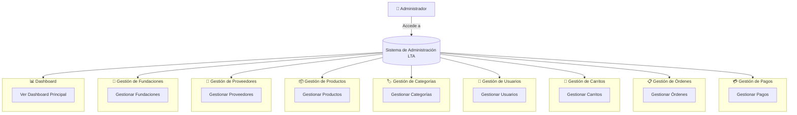

---

## Diagrama 2: Caso de Uso de Funcionalidades Detalladas

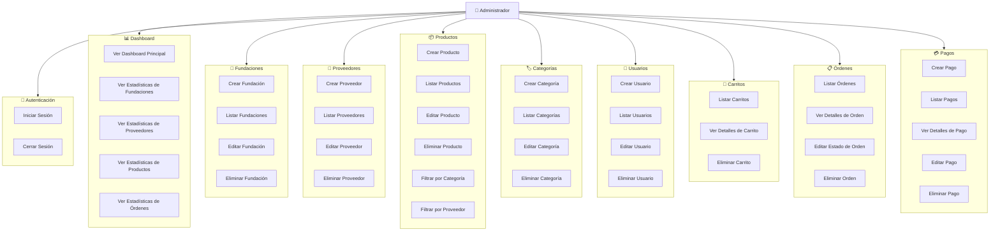

---

## Diagrama 3: Caso de Uso por Actor - Administrador

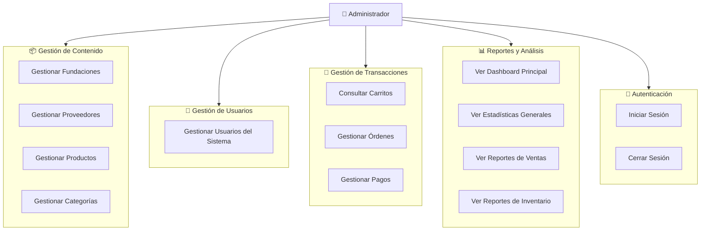

---

## Diagrama 3b: Caso de Uso por Actor - Usuario del Sistema (Futuro)

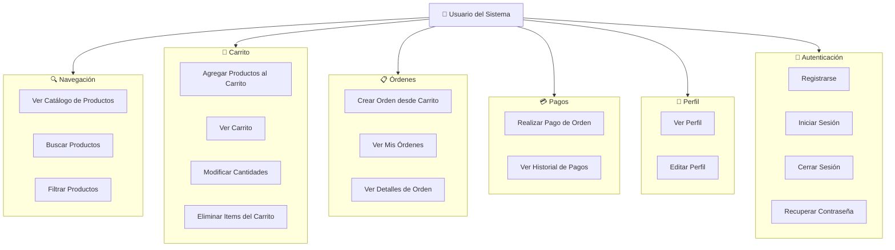

---

## Diagrama 4: Caso de Uso con Relaciones y Dependencias

```mermaid
graph TB
    Admin[👤 Administrador]
    
    subgraph CRUD["Operaciones CRUD"]
        UC_Create[Crear]
        UC_Read[Listar/Ver]
        UC_Update[Editar]
        UC_Delete[Eliminar]
    end
    
    subgraph Validaciones["Validaciones"]
        Val1[Validar Dependencias]
        Val2[Validar Productos Asociados]
        Val3[Validar Carritos Activos]
        Val4[Validar Orden]
        Val5[Validar Carrito]
    end
    
    subgraph Auth["Autenticación"]
        Auth_UC[Autenticación Requerida]
    end
    
    UC_Delete -.->|extend| Val1
    UC_Delete -.->|extend| Val2
    UC_Delete -.->|extend| Val3
    
    UC_Create -.->|include| Auth_UC
    UC_Read -.->|include| Auth_UC
    UC_Update -.->|include| Auth_UC
    UC_Delete -.->|include| Auth_UC
    
    subgraph Fundaciones["Fundaciones"]
        UC_F_Create[Crear Fundación]
        UC_F_Delete[Eliminar Fundación]
    end
    
    subgraph Proveedores["Proveedores"]
        UC_Prov_Create[Crear Proveedor]
        UC_Prov_Delete[Eliminar Proveedor]
    end
    
    subgraph Productos["Productos"]
        UC_Prod_Create[Crear Producto]
        UC_Prod_Delete[Eliminar Producto]
    end
    
    subgraph Ordenes["Órdenes"]
        UC_Ord_Create[Crear Orden]
        UC_Ord_Pay[Realizar Pago]
    end
    
    UC_F_Delete -.->|extend| Val1
    UC_Prov_Delete -.->|extend| Val2
    UC_Prod_Delete -.->|extend| Val3
    UC_Ord_Create -.->|include| Val5
    UC_Ord_Pay -.->|include| Val4
    
    Admin --> Fundaciones
    Admin --> Proveedores
    Admin --> Productos
    Admin --> Ordenes
```

---

## Diagrama 5a: Caso de Uso - Módulo Gestión de Fundaciones

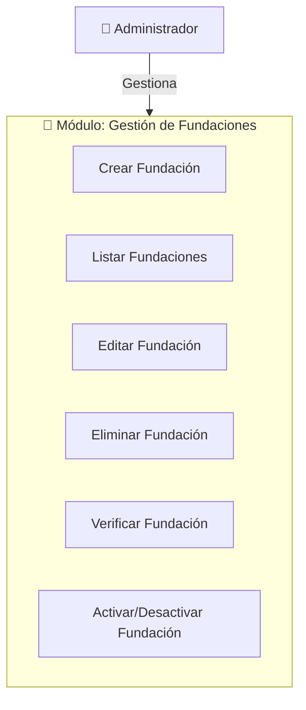

---

## Diagrama 5b: Caso de Uso - Módulo Gestión de Proveedores

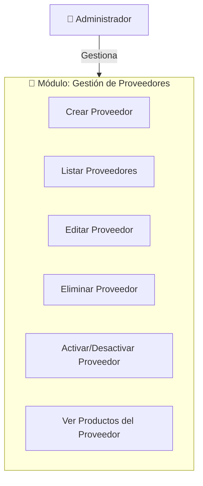

---

## Diagrama 5c: Caso de Uso - Módulo Gestión de Productos

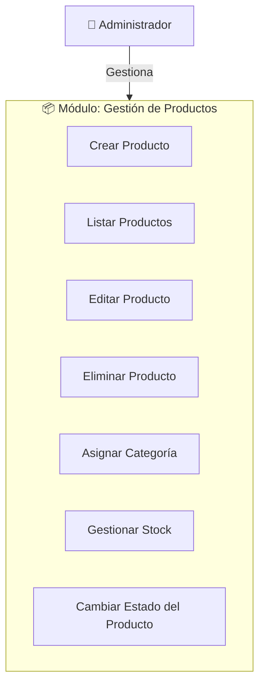

---

## Diagrama 5d: Caso de Uso - Módulo Gestión de Categorías

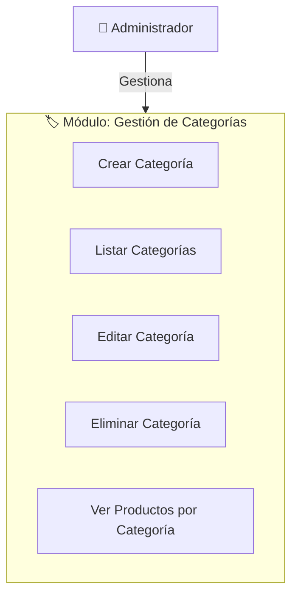

---

## Diagrama 5e: Caso de Uso - Módulo Gestión de Usuarios

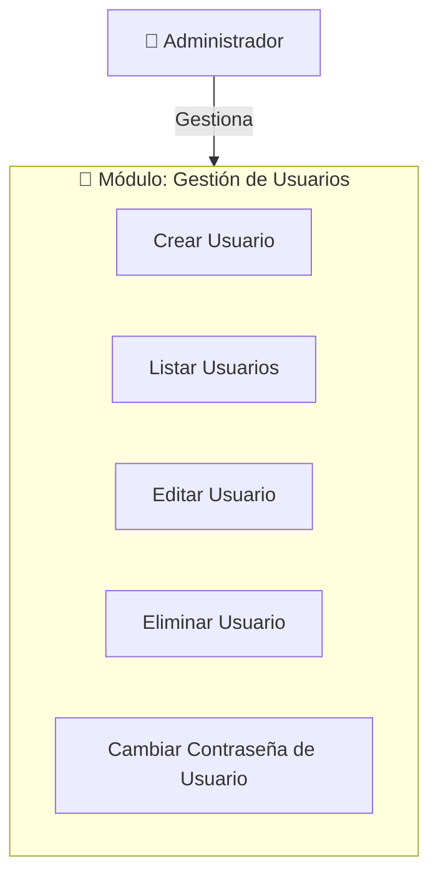

---

## Diagrama 5f: Caso de Uso - Módulo Gestión de Carritos

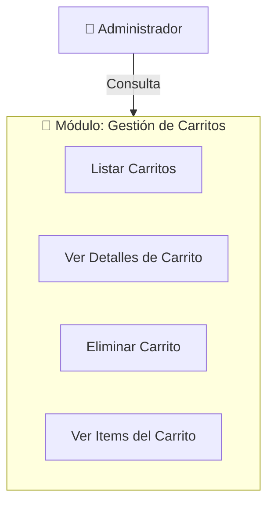

---

## Diagrama 5g: Caso de Uso - Módulo Gestión de Órdenes

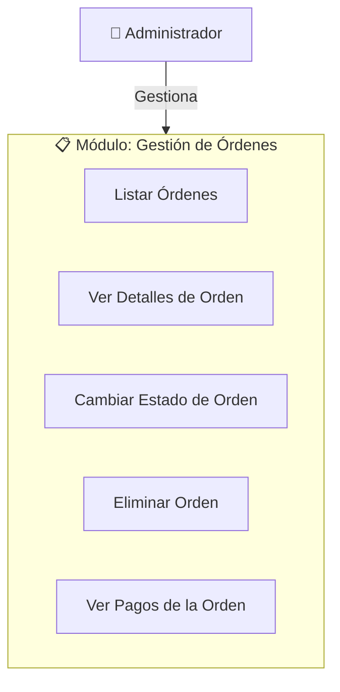

---

## Diagrama 5h: Caso de Uso - Módulo Gestión de Pagos

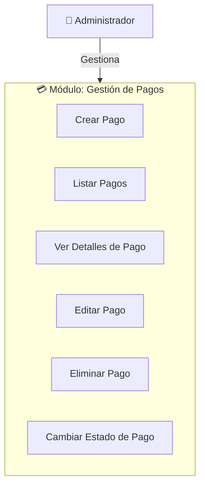

---

## Diagrama 5i: Caso de Uso - Módulo Dashboard y Reportes

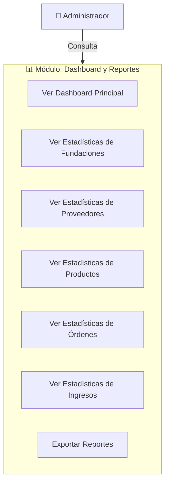

---

## Diagrama 5j: Caso de Uso - Módulo Autenticación

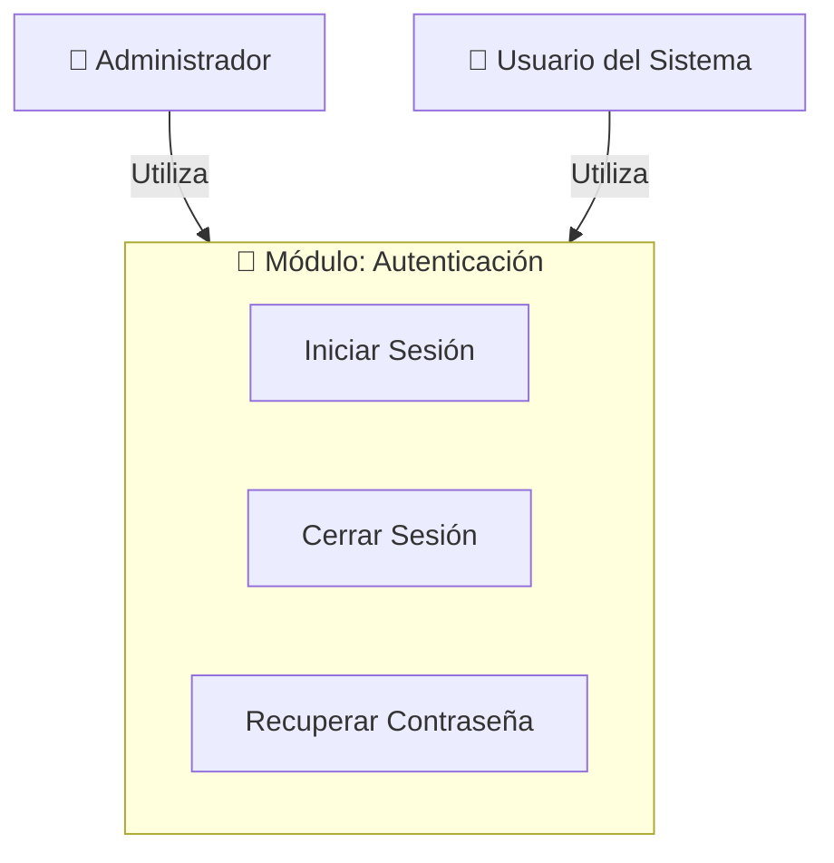

---

## Notas sobre los Diagramas

1. **Símbolos utilizados:**
   - 👤 = Actor (Usuario/Administrador)
   - 📊 = Dashboard/Reportes
   - 🏢 = Fundaciones
   - 🤝 = Proveedores
   - 📦 = Productos
   - 🏷️ = Categorías
   - 👥 = Usuarios
   - 🛒 = Carritos
   - 📋 = Órdenes
   - 💳 = Pagos
   - 🔐 = Autenticación

2. **Relaciones:**
   - `-->` = Relación directa (Actor realiza caso de uso)
   - `-.->` = Relación de dependencia (include/extend)

3. **Uso:**
   - Estos diagramas pueden copiarse directamente en herramientas que soporten Mermaid
   - Compatible con: GitHub, GitLab, Notion, Obsidian, y muchas otras plataformas
   - También pueden renderizarse en: https://mermaid.live/

---

## Diagrama Completo Consolidado (Opcional)

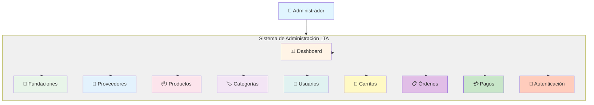

