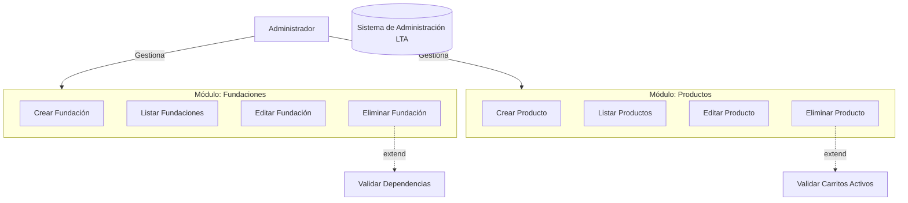

# Prompts para Generación de Diagramas de Casos de Uso en Mermaid

Este documento contiene prompts estructurados para que un agente genere diagramas de casos de uso en formato Mermaid para el sistema de administración LTA.

---

## Prompt 1: Diagrama de Caso de Uso General del Sistema

```
Genera un diagrama de casos de uso en formato Mermaid que represente el sistema completo de administración LTA. 

El sistema debe incluir los siguientes módulos principales:
- Gestión de Fundaciones
- Gestión de Proveedores
- Gestión de Productos
- Gestión de Categorías
- Gestión de Usuarios
- Gestión de Carritos
- Gestión de Órdenes
- Gestión de Pagos
- Dashboard Administrativo

Actores principales:
- Administrador
- Usuario del Sistema

El diagrama debe mostrar:
1. El sistema como un rectángulo principal
2. Todos los casos de uso agrupados por módulo
3. Las relaciones entre actores y casos de uso
4. Las dependencias entre casos de uso cuando sea relevante

Formato de salida: Código Mermaid válido para diagrama de casos de uso (graph TD o similar con sintaxis de casos de uso).
```

---

## Prompt 2: Diagrama de Caso de Uso de Funcionalidades Detalladas

```
Genera un diagrama de casos de uso en formato Mermaid que detalle todas las funcionalidades CRUD del sistema de administración LTA.

Para cada módulo, incluye los siguientes casos de uso:

**Fundaciones:**
- Crear Fundación
- Listar Fundaciones
- Editar Fundación
- Eliminar Fundación
- Ver Detalles de Fundación

**Proveedores:**
- Crear Proveedor
- Listar Proveedores
- Editar Proveedor
- Eliminar Proveedor
- Ver Detalles de Proveedor

**Productos:**
- Crear Producto
- Listar Productos
- Editar Producto
- Eliminar Producto
- Ver Detalles de Producto
- Filtrar Productos por Categoría
- Filtrar Productos por Proveedor

**Categorías:**
- Crear Categoría
- Listar Categorías
- Editar Categoría
- Eliminar Categoría

**Usuarios:**
- Crear Usuario
- Listar Usuarios
- Editar Usuario
- Eliminar Usuario
- Ver Detalles de Usuario

**Carritos:**
- Listar Carritos
- Ver Detalles de Carrito
- Eliminar Carrito

**Órdenes:**
- Listar Órdenes
- Ver Detalles de Orden
- Editar Estado de Orden
- Eliminar Orden

**Pagos:**
- Crear Pago
- Listar Pagos
- Ver Detalles de Pago
- Editar Pago
- Eliminar Pago

**Dashboard:**
- Ver Dashboard Principal
- Ver Estadísticas de Fundaciones
- Ver Estadísticas de Proveedores
- Ver Estadísticas de Productos
- Ver Estadísticas de Órdenes

**Autenticación:**
- Iniciar Sesión
- Cerrar Sesión

Actores:
- Administrador (acceso completo a todas las funcionalidades)

Formato de salida: Código Mermaid válido con todos los casos de uso organizados jerárquicamente.
```

---

## Prompt 3: Diagrama de Caso de Uso por Actor

```
Genera diagramas de casos de uso en formato Mermaid separados por actor para el sistema de administración LTA.

### Actor: Administrador

El administrador tiene acceso completo al sistema. Genera un diagrama que muestre:

1. **Gestión de Contenido:**
   - Gestionar Fundaciones (CRUD completo)
   - Gestionar Proveedores (CRUD completo)
   - Gestionar Productos (CRUD completo)
   - Gestionar Categorías (CRUD completo)

2. **Gestión de Usuarios:**
   - Gestionar Usuarios del Sistema (CRUD completo)

3. **Gestión de Transacciones:**
   - Consultar Carritos
   - Gestionar Órdenes (Ver, Editar Estado, Eliminar)
   - Gestionar Pagos (CRUD completo)

4. **Reportes y Análisis:**
   - Ver Dashboard Principal
   - Ver Estadísticas Generales
   - Ver Reportes de Ventas
   - Ver Reportes de Inventario

5. **Autenticación:**
   - Iniciar Sesión
   - Cerrar Sesión

### Actor: Usuario del Sistema (Futuro)

Si el sistema tiene usuarios finales, genera un diagrama adicional que muestre:

1. **Navegación:**
   - Ver Catálogo de Productos
   - Buscar Productos
   - Filtrar Productos

2. **Carrito:**
   - Agregar Productos al Carrito
   - Ver Carrito
   - Modificar Cantidades
   - Eliminar Items del Carrito

3. **Órdenes:**
   - Crear Orden desde Carrito
   - Ver Mis Órdenes
   - Ver Detalles de Orden

4. **Pagos:**
   - Realizar Pago de Orden
   - Ver Historial de Pagos

5. **Perfil:**
   - Ver Perfil
   - Editar Perfil

6. **Autenticación:**
   - Registrarse
   - Iniciar Sesión
   - Cerrar Sesión
   - Recuperar Contraseña

Formato de salida: Código Mermaid separado para cada actor, mostrando claramente qué casos de uso puede realizar cada uno.
```

---

## Prompt 4: Diagrama de Caso de Uso con Relaciones y Dependencias

```
Genera un diagrama de casos de uso en formato Mermaid que muestre las relaciones y dependencias entre casos de uso del sistema de administración LTA.

Incluye:

1. **Dependencias de inclusión (include):**
   - "Ver Detalles" siempre incluye "Autenticación"
   - "Crear Orden" incluye "Validar Carrito"
   - "Realizar Pago" incluye "Validar Orden"

2. **Dependencias de extensión (extend):**
   - "Eliminar Fundación" se extiende con "Validar Dependencias" (si tiene proveedores asociados)
   - "Eliminar Proveedor" se extiende con "Validar Productos Asociados"
   - "Eliminar Producto" se extiende con "Validar Carritos Activos"

3. **Relaciones de herencia:**
   - "Gestionar Fundaciones" es generalización de (Crear, Editar, Eliminar, Listar)
   - "Gestionar Productos" es generalización de (Crear, Editar, Eliminar, Listar)

4. **Actores y sus relaciones:**
   - Administrador → Todos los casos de uso administrativos
   - Usuario → Casos de uso de cliente (si aplica)

Formato de salida: Código Mermaid que muestre claramente las relaciones include, extend y generalización entre casos de uso.
```

---

## Prompt 5: Diagrama de Caso de Uso por Módulo/Funcionalidad

```
Genera diagramas de casos de uso en formato Mermaid separados por módulo para el sistema de administración LTA.

### Módulo 1: Gestión de Fundaciones
- Actor: Administrador
- Casos de uso:
  - Crear Fundación
  - Listar Fundaciones
  - Editar Fundación
  - Eliminar Fundación
  - Verificar Fundación
  - Activar/Desactivar Fundación

### Módulo 2: Gestión de Proveedores
- Actor: Administrador
- Casos de uso:
  - Crear Proveedor
  - Listar Proveedores
  - Editar Proveedor
  - Eliminar Proveedor
  - Activar/Desactivar Proveedor
  - Ver Productos del Proveedor

### Módulo 3: Gestión de Productos
- Actor: Administrador
- Casos de uso:
  - Crear Producto
  - Listar Productos
  - Editar Producto
  - Eliminar Producto
  - Asignar Categoría
  - Gestionar Stock
  - Cambiar Estado del Producto

### Módulo 4: Gestión de Categorías
- Actor: Administrador
- Casos de uso:
  - Crear Categoría
  - Listar Categorías
  - Editar Categoría
  - Eliminar Categoría
  - Ver Productos por Categoría

### Módulo 5: Gestión de Usuarios
- Actor: Administrador
- Casos de uso:
  - Crear Usuario
  - Listar Usuarios
  - Editar Usuario
  - Eliminar Usuario
  - Cambiar Contraseña de Usuario

### Módulo 6: Gestión de Carritos
- Actor: Administrador
- Casos de uso:
  - Listar Carritos
  - Ver Detalles de Carrito
  - Eliminar Carrito
  - Ver Items del Carrito

### Módulo 7: Gestión de Órdenes
- Actor: Administrador
- Casos de uso:
  - Listar Órdenes
  - Ver Detalles de Orden
  - Cambiar Estado de Orden
  - Eliminar Orden
  - Ver Pagos de la Orden

### Módulo 8: Gestión de Pagos
- Actor: Administrador
- Casos de uso:
  - Crear Pago
  - Listar Pagos
  - Ver Detalles de Pago
  - Editar Pago
  - Eliminar Pago
  - Cambiar Estado de Pago

### Módulo 9: Dashboard y Reportes
- Actor: Administrador
- Casos de uso:
  - Ver Dashboard Principal
  - Ver Estadísticas de Fundaciones
  - Ver Estadísticas de Proveedores
  - Ver Estadísticas de Productos
  - Ver Estadísticas de Órdenes
  - Ver Estadísticas de Ingresos
  - Exportar Reportes

### Módulo 10: Autenticación
- Actor: Administrador, Usuario
- Casos de uso:
  - Iniciar Sesión
  - Cerrar Sesión
  - Recuperar Contraseña (futuro)

Formato de salida: Código Mermaid separado para cada módulo, mostrando claramente los casos de uso específicos de cada área funcional.
```

---

## Instrucciones de Uso

1. **Para el Agente:**
   - Usa estos prompts como base para generar diagramas Mermaid
   - Adapta los casos de uso según la información específica del sistema
   - Asegúrate de usar la sintaxis correcta de Mermaid para diagramas de casos de uso
   - Valida que el código generado sea válido

2. **Sintaxis Mermaid para Casos de Uso:**
   ```mermaid
   graph TB
       Actor[Administrador]
       System[("Sistema LTA")]
       
       Actor -->|Realiza| UC1[Crear Fundación]
       Actor -->|Realiza| UC2[Listar Fundaciones]
       
       UC1 -.->|include| Auth[Autenticación]
       UC2 -.->|include| Auth
   ```

3. **Validación:**
   - Verifica que todos los casos de uso mencionados existan en el sistema
   - Asegúrate de que las relaciones entre actores y casos de uso sean correctas
   - Revisa que las dependencias (include/extend) sean lógicas

---

## Ejemplo de Salida Esperada

El agente debe generar código Mermaid similar a:



---

## Notas Adicionales

- Los diagramas deben ser claros y fáciles de entender
- Usa colores y agrupaciones para mejorar la legibilidad
- Incluye leyendas cuando uses relaciones especiales (include, extend)
- Mantén la consistencia en la nomenclatura de casos de uso
- Considera las limitaciones actuales del sistema (ej: Carritos y Órdenes no tienen Create/Store desde admin)

